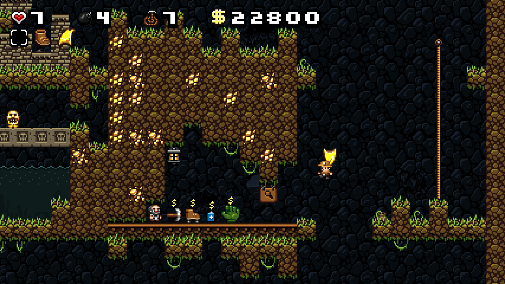

# Cheat builds

These builds are primarily made to make localization easier but, of course, could also be used just to have fun :)

## What you can do with them:
- **F2 / Touch Button 1**: move between levels
- **F3 / Touch Button 2**: set money count to 200000, health to 99. Adjust statistics to open shortcuts and challenges
- **F4 / Touch Button 3**: switch between items bundles
- **F5 / Touch Button 4**: summon items bundle

## Items bundles:
### Bundle 1
- Rock
- RopePile
- BombBox
- LockedChest
- Damsel
- Key
### Bundle 2
- Bow
- Pistol
- Shotgun
- WebCannon
- Machete
- Mattock
### Bundle 3
- Gloves
- Mitt
- SpringShoes
- SpikeShoes
- Spectacles
- CapePickup
### Bundle 4
- Jetpack
- ParaPickup
- Compass
- FlareCrate
- Crate
- Paste
### Bundle 5
- UdjatEye
- Ankh
- Crown
- Sceptre
- Teleporter
- Kapala
### Bundle 6
- LampItem
- LampRedItem
- Arrow
- Basketball
- Jordans
- Caveman