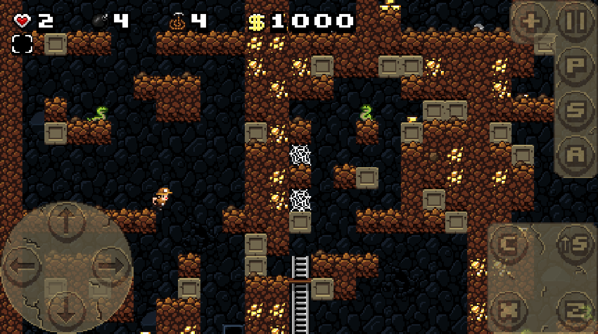

# Spelunky Classic HD

**Mirrors: [Github](https://github.com/yancharkin/SpelunkyClassicHD), [Bitbucket](https://bitbucket.org/yancharkin/spelunkyclassichd), [Gitlab](https://gitlab.com/yancharkin/SpelunkyClassicHD)**

A modified version of [Derek Yu's](https://en.wikipedia.org/wiki/Derek_Yu) game [Spelunky Classic](https://spelunkyworld.com/original.html). Based on the source code published in **Humble Weekly Bundle: Play and Create with GameMaker** (not original 1.1 release).

## New in this version:
- builds for different operating systems
- different aspect ratios (originally 4:3 only)
- touch input
- support for translations
- proper in-game menu
- better gamepads support

## Translators
- [grheavy](mailto:grheavy@hushmail.com) - Spanish
- [Spenĉjo](https://github.com/Rajzin) - Esperanto
- [Gabriel Albuquerque Ferreira](https://github.com/ngc-5194) - Brazilian Portuguese

## Links
* [Game's page on Itch](https://yancharkin.itch.io/spelunky-classic-hd)
* [HTML5 version: Linux (amd64, arm64, armv7l), macOS, Windows (x64) builds](https://github.com/yancharkin/SpelunkyClassicHDhtml5)
* [How to localize the game](localization)
